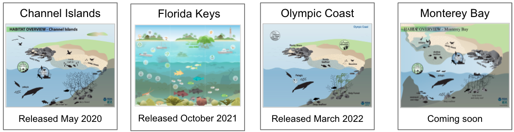
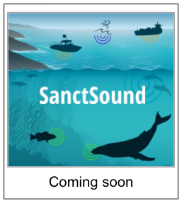

## WebCR - Webenized Condition Reporting

The Webenized Condition Reporting (WebCR) platform pairs artwork with information to make it easy to explore and track how ecosystem conditions are changing at a sanctuary. Select a sanctuary below to start exploring that sanctuary’s ecosystem. Navigate by clicking on icons representing major habitats, species of interest, climate and ocean drivers, and human connections. Interactive icons and silhouettes are linked to status and trend data, images, web stories and other related content. The goal of WebCRs are to help us keep our finger on the pulse of these dynamic ecosystems and to help us to better understand and manage our sanctuaries together. Tiles for other sanctuaries will be added below as those tools become available.

## Issues
`
A number of pressing issues are facing sanctuaries, such as ocean noise, invasive species, marine debris, and climate change. Below are interactive tools that improve access to monitoring and characterization information that address these issues. 

